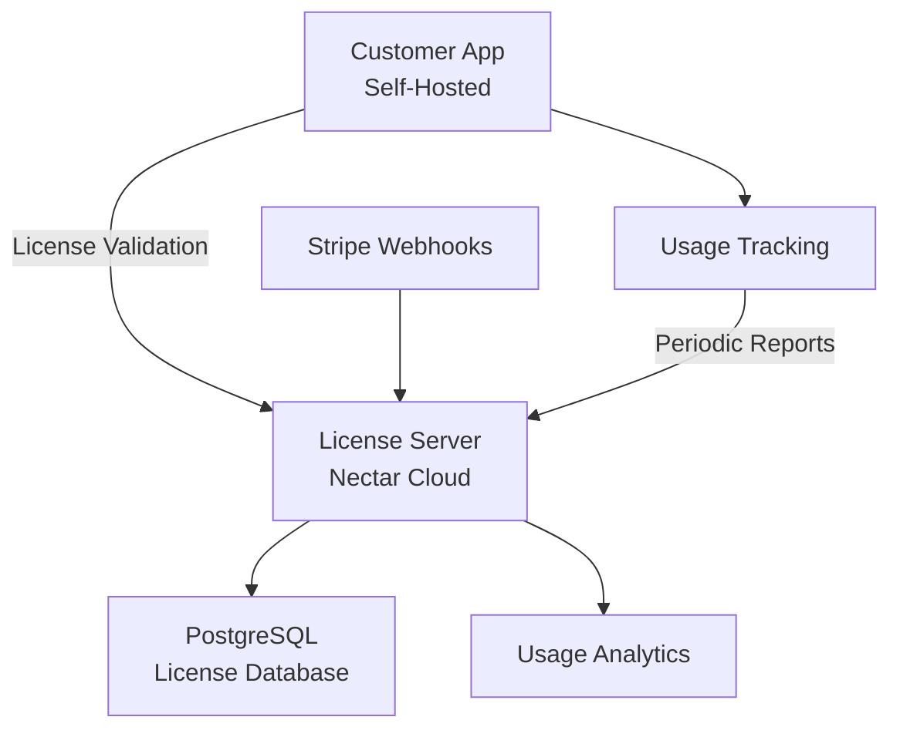

# Nectar Self-Hosted Licensing Implementation Roadmap

## 📋 Project Overview

This document outlines the complete implementation of an enterprise-grade licensing system for Nectar's self-hosted offering. The system enables customers to run Nectar on-premise while maintaining licensing control and preventing piracy through a hybrid cloud architecture.

## ✅ Phase 1: Core Infrastructure (COMPLETED)

### What We Have Built

#### 1. License Server Infrastructure ✅
**Location**: `license-server/`
- **Deliverable**: Production-ready Node.js/Express server on port 6000
- **Features Implemented**:
  - Express server with security middleware (Helmet, CORS, rate limiting)
  - Winston logging with file rotation and structured output
  - Health check endpoints (`/health`, `/metrics`)
  - Environment configuration with `.env.example`
  - Graceful shutdown handling and error management
- **Security**: JWT authentication, API key management, request validation
- **Status**: ✅ Complete and production-ready

#### 2. JWT-Based License Key System ✅
**Location**: `license-server/src/services/licenseService.js`
- **Deliverable**: Secure license key generation and validation
- **Features Implemented**:
  - License key format: `NLS-{base64url-jwt}-{8-char-checksum}`
  - JWT signing with configurable secrets and expiration
  - Checksum verification for key integrity
  - License suspension/reactivation capabilities
  - Deployment tracking and heartbeat monitoring
- **Anti-Piracy**: Cryptographic signatures, deployment ID tracking, usage analytics
- **Status**: ✅ Complete with enterprise-grade security

#### 3. PostgreSQL Database Schema ✅
**Location**: `license-server/prisma/schema.prisma`
- **Deliverable**: Complete data model for license management
- **Tables Implemented**:
  - `customers`: Customer information and Stripe integration
  - `licenses`: License details, features, and limits
  - `usage_records`: Usage metrics and analytics
  - `validation_logs`: License validation audit trail
  - `audit_logs`: Complete system audit logging
  - `api_keys`: API authentication management
  - `system_configuration`: Dynamic configuration
- **Features**: Multi-tenant support, audit trails, usage analytics, compliance logging
- **Status**: ✅ Complete with full relational integrity

#### 4. License Server API Endpoints ✅
**Location**: `license-server/src/controllers/`
- **Deliverable**: RESTful API for all license operations
- **Endpoints Implemented**:
  - **License Management** (`/api/licenses`): Create, read, update, suspend, reactivate
  - **License Validation** (`/api/validation`): Real-time validation, status checks, heartbeat
  - **Usage Reporting** (`/api/usage`): Metrics collection, analytics, reporting
  - **Customer Management** (`/api/customers`): Customer CRUD operations
  - **Webhook Integration** (`/api/webhooks`): Stripe payment event handling
  - **Admin Dashboard** (`/api/admin`): System statistics and health monitoring
- **Security**: Request validation, permission-based access, rate limiting
- **Status**: ✅ Complete with comprehensive API coverage

#### 5. Customer App License Validation ✅
**Location**: `server/middleware/licenseValidation.js`
- **Deliverable**: Client-side license validation and enforcement
- **Features Implemented**:
  - Express middleware for license validation (`requireValidLicense`)
  - Feature gating middleware (`requireFeature`)
  - Usage limit enforcement (`checkUsageLimit`)
  - Offline mode with configurable grace periods (30 days default)
  - Automatic heartbeat and deployment tracking
  - Periodic license validation with caching
- **Offline Capabilities**: 30-day offline operation, 7-day grace period, cached validation
- **Status**: ✅ Complete with robust offline support

#### 6. Usage Tracking System ✅
**Location**: `server/services/usageTracking.js`
- **Deliverable**: Automatic usage metrics collection and reporting
- **Metrics Tracked**:
  - Active users and sessions
  - Workflow executions and complexity
  - API calls and endpoint usage
  - Storage consumption in bytes
  - Integration usage patterns
  - Data processing volumes
- **Features**: Real-time collection, periodic reporting, Express middleware integration
- **Status**: ✅ Complete with comprehensive metrics

### Architecture Summary



**Data Flow**:
1. Customer app validates license on startup and periodically
2. License server verifies JWT signature and database status
3. Usage metrics are collected automatically and reported daily
4. Stripe webhooks update license status for billing events
5. Admin dashboard provides real-time monitoring and analytics

## 🚀 Phase 2: Advanced Features (REMAINING)

### 7. Cloud API Services for Core Business Logic
**Priority**: High | **Estimated Time**: 3-4 weeks

#### Objective
Move critical business logic to cloud services to maintain control over proprietary algorithms while allowing self-hosted deployment.

#### Detailed Implementation Steps

**Step 7.1: Design Cloud API Architecture (Week 1)**
- Create `cloud-api-server/` directory structure
- Design microservices architecture for core business logic:
  - Workflow execution engine API
  - Advanced integration services
  - AI/ML processing services
  - Data transformation utilities
- Define API contracts and authentication methods
- Set up environment configuration and deployment structure

**Step 7.2: Implement Workflow Engine API (Week 1-2)**
```
cloud-api-server/
├── src/services/
│   ├── workflowEngine.js      # Core workflow execution logic
│   ├── nodeProcessors/        # Individual node processors
│   └── executionContext.js   # Workflow execution context
├── controllers/
│   └── workflowController.js  # API endpoints for workflows
└── middleware/
    └── customerAuth.js        # Customer license validation
```
- Implement workflow execution engine as cloud service
- Create API endpoints for workflow validation and execution
- Add customer authentication using license keys
- Implement rate limiting based on license tiers

**Step 7.3: Integration Services API (Week 2-3)**
```
cloud-api-server/src/services/
├── integrations/
│   ├── salesforceConnector.js
│   ├── hubspotConnector.js
│   ├── slackConnector.js
│   └── customIntegrations.js
└── integrationOrchestrator.js
```
- Move complex integration logic to cloud APIs
- Implement OAuth token management for third-party services
- Add integration-specific rate limiting and usage tracking
- Create webhook relay services for real-time data

**Step 7.4: Customer App Integration (Week 3-4)**
```
server/services/
├── cloudApiClient.js          # Client for cloud API calls
├── workflowProxy.js           # Proxy workflow requests to cloud
└── integrationProxy.js        # Proxy integration requests to cloud
```
- Update customer app to use cloud APIs for core functions
- Implement caching layer for frequently used cloud responses
- Add fallback mechanisms for cloud service outages
- Update license validation to check cloud API permissions

**Step 7.5: Testing and Deployment (Week 4)**
- Set up cloud API server deployment pipeline
- Implement comprehensive API testing
- Add monitoring and alerting for cloud services
- Create documentation for cloud API integration

#### Success Criteria
- Core business logic moved to cloud APIs
- Customer apps can function with basic features during cloud outages
- Cloud services scale independently of customer deployments
- Clear separation between self-hosted and cloud-only features

---

### 8. Admin Portal License Management Interface
**Priority**: High | **Estimated Time**: 2-3 weeks

#### Objective
Create a comprehensive admin interface for managing licenses, customers, and monitoring system health.

#### Detailed Implementation Steps

**Step 8.1: Admin Portal Setup (Week 1)**
```
admin-frontend/src/pages/licenses/
├── LicenseList.jsx            # List all licenses with filtering
├── LicenseDetails.jsx         # Detailed license view
├── CreateLicense.jsx          # License creation form
├── EditLicense.jsx            # License editing interface
└── LicenseAnalytics.jsx       # Usage analytics dashboard
```
- Set up React pages for license management
- Implement data tables with sorting, filtering, and pagination
- Create forms for license creation and modification
- Add bulk operations for license management

**Step 8.2: Customer Management Interface (Week 1)**
```
admin-frontend/src/pages/customers/
├── CustomerList.jsx           # Customer directory
├── CustomerDetails.jsx        # Customer profile and licenses
├── CustomerAnalytics.jsx      # Customer usage analytics
└── BillingIntegration.jsx     # Stripe billing management
```
- Build customer management interface
- Integrate with Stripe for billing information
- Add customer communication tools
- Implement customer support ticket integration

**Step 8.3: System Monitoring Dashboard (Week 2)**
```
admin-frontend/src/pages/dashboard/
├── SystemHealth.jsx           # System status and alerts
├── UsageAnalytics.jsx         # Global usage statistics
├── LicenseMetrics.jsx         # License compliance metrics
└── RevenueReporting.jsx       # Revenue and billing analytics
```
- Create real-time system health dashboard
- Implement usage analytics with charts and graphs
- Add license compliance monitoring
- Build revenue reporting and forecasting tools

**Step 8.4: Advanced Features (Week 2-3)**
```
admin-frontend/src/components/
├── LicenseWizard.jsx          # Guided license creation
├── BulkOperations.jsx         # Bulk license operations
├── AlertsManager.jsx          # System alerts configuration
└── AuditTrail.jsx             # Audit log viewer
```
- Implement guided license creation wizard
- Add bulk operations for license management
- Create alerts and notification system
- Build audit trail viewer for compliance

**Step 8.5: Integration and Testing (Week 3)**
- Connect admin portal to license server APIs
- Implement role-based access control
- Add comprehensive error handling
- Create admin user documentation

#### Success Criteria
- Complete license lifecycle management through UI
- Real-time system monitoring and alerting
- Customer self-service portal capabilities
- Compliance reporting and audit trails

---

### 9. Docker Image Build and Distribution Pipeline
**Priority**: Medium | **Estimated Time**: 2-3 weeks

#### Objective
Create automated Docker image building and distribution system for customer deployments.

#### Detailed Implementation Steps

**Step 9.1: Customer App Containerization (Week 1)**
```
customer-app/
├── Dockerfile.customer         # Customer app container
├── docker-compose.customer.yml # Customer deployment stack
├── .dockerignore              # Docker build exclusions
└── scripts/
    ├── build-customer.sh      # Customer image build script
    └── prepare-distribution.sh # Distribution preparation
```
- Create optimized Dockerfile for customer application
- Remove all marketing and admin components from customer build
- Configure environment variables for license integration
- Add health checks and monitoring endpoints

**Step 9.2: Build Pipeline Setup (Week 1-2)**
```
.github/workflows/
├── build-customer-image.yml    # GitHub Actions for builds
├── security-scan.yml          # Security vulnerability scanning
└── release-customer.yml       # Customer release pipeline

scripts/
├── version-management.sh      # Semantic versioning
├── changelog-generator.sh     # Automatic changelog
└── distribution-builder.sh    # Complete distribution package
```
- Set up GitHub Actions for automated builds
- Implement semantic versioning for customer releases
- Add security scanning for Docker images
- Create automated testing pipeline

**Step 9.3: Distribution System (Week 2)**
```
distribution/
├── customer-package/
│   ├── docker-compose.yml     # Customer deployment config
│   ├── .env.template         # Environment configuration
│   ├── install.sh            # Installation script
│   └── README.md             # Deployment instructions
└── registry/
    ├── registry-auth.js      # Private registry authentication
    └── image-management.js   # Image lifecycle management
```
- Set up private Docker registry for customer images
- Implement license-based image access control
- Create customer installation packages
- Add automatic update mechanisms

**Step 9.4: Customer Deployment Tools (Week 2-3)**
```
customer-tools/
├── nectar-cli/               # Command-line deployment tool
│   ├── install.js           # Installation wizard
│   ├── update.js            # Update management
│   └── diagnose.js          # Diagnostic tools
└── deployment-templates/
    ├── docker-compose/      # Docker Compose templates
    ├── kubernetes/          # Kubernetes manifests
    └── cloud-providers/     # Cloud-specific deployments
```
- Build CLI tool for customer deployments
- Create deployment templates for different environments
- Add diagnostic and troubleshooting tools
- Implement backup and restore utilities

**Step 9.5: Testing and Documentation (Week 3)**
- Test deployment on multiple environments
- Create comprehensive deployment documentation
- Add monitoring and alerting for customer deployments
- Build customer support tools and procedures

#### Success Criteria
- Automated Docker image builds with security scanning
- Private registry with license-based access control
- One-click customer deployment experience
- Comprehensive deployment documentation and tools

---

### 10. Automated License Lifecycle Management
**Priority**: Medium | **Estimated Time**: 2-3 weeks

#### Objective
Implement automated systems for license renewals, notifications, and lifecycle management.

#### Detailed Implementation Steps

**Step 10.1: License Lifecycle Engine (Week 1)**
```
license-server/src/services/
├── lifecycleManager.js        # Core lifecycle management
├── notificationService.js     # Email/SMS notifications
├── renewalProcessor.js        # Automatic renewals
└── expirationHandler.js       # Expiration workflows
```
- Implement license lifecycle state machine
- Create notification system for license events
- Add automatic renewal processing
- Build expiration warning and grace period handling

**Step 10.2: Automated Workflows (Week 1-2)**
```
license-server/src/workflows/
├── renewalWorkflow.js         # Renewal automation
├── expirationWorkflow.js      # Expiration handling
├── suspensionWorkflow.js      # Account suspension
└── reactivationWorkflow.js    # Account reactivation
```
- Build automated renewal workflows
- Implement payment retry logic with Stripe
- Create license suspension and reactivation processes
- Add customer communication automation

**Step 10.3: Customer Communication System (Week 2)**
```
license-server/src/communications/
├── emailTemplates/           # Email templates
│   ├── renewal-reminder.html
│   ├── expiration-warning.html
│   └── suspension-notice.html
├── smsTemplates/            # SMS notifications
└── communicationScheduler.js # Scheduled communications
```
- Create email and SMS template system
- Implement scheduled notification campaigns
- Add customer preference management
- Build communication audit trail

**Step 10.4: Admin Tools and Reporting (Week 2-3)**
```
admin-frontend/src/pages/lifecycle/
├── LifecycleDashboard.jsx    # Lifecycle overview
├── RenewalManagement.jsx     # Renewal pipeline
├── ExpirationAlerts.jsx      # Expiration monitoring
└── CommunicationLogs.jsx     # Communication history
```
- Build admin dashboard for lifecycle management
- Create renewal pipeline visualization
- Add expiration monitoring and alerts
- Implement communication history and analytics

**Step 10.5: Integration and Testing (Week 3)**
- Integrate with existing billing systems
- Test automated workflows thoroughly
- Add monitoring and alerting for lifecycle events
- Create customer self-service renewal portal

#### Success Criteria
- Fully automated license renewal process
- Proactive customer communication system
- Comprehensive lifecycle monitoring and reporting
- Reduced manual intervention in license management

---

### 11. Comprehensive Testing Infrastructure
**Priority**: High | **Estimated Time**: 3-4 weeks

#### Objective
Implement complete testing infrastructure covering unit tests, integration tests, security tests, and end-to-end validation.

#### Detailed Implementation Steps

**Step 11.1: License Server Testing (Week 1)**
```
license-server/tests/
├── unit/
│   ├── services/licenseService.test.js
│   ├── controllers/validation.test.js
│   └── middleware/auth.test.js
├── integration/
│   ├── api/licenses.test.js
│   ├── database/prisma.test.js
│   └── webhooks/stripe.test.js
└── fixtures/
    ├── testLicenses.js
    └── mockCustomers.js
```
- Write comprehensive unit tests for all services
- Create integration tests for API endpoints
- Add database testing with test fixtures
- Implement webhook testing with mock data

**Step 11.2: Customer App Testing (Week 1-2)**
```
server/tests/
├── middleware/
│   ├── licenseValidation.test.js
│   └── usageTracking.test.js
├── services/
│   └── cloudApiClient.test.js
└── e2e/
    ├── licenseFlow.test.js
    └── offlineMode.test.js
```
- Test license validation middleware thoroughly
- Create tests for usage tracking accuracy
- Add end-to-end license flow testing
- Test offline mode and grace period functionality

**Step 11.3: Security Testing (Week 2)**
```
tests/security/
├── authentication.test.js     # API key and JWT testing
├── authorization.test.js      # Permission testing
├── rateLimit.test.js         # Rate limiting validation
├── sqlInjection.test.js      # SQL injection prevention
└── encryption.test.js        # Data encryption testing
```
- Implement comprehensive security testing
- Test authentication and authorization systems
- Validate rate limiting and abuse prevention
- Test data encryption and key management

**Step 11.4: Performance and Load Testing (Week 2-3)**
```
tests/performance/
├── loadTesting/
│   ├── licenseValidation.js   # License validation load tests
│   ├── usageReporting.js     # Usage reporting performance
│   └── apiEndpoints.js       # API endpoint performance
├── stress/
│   └── concurrentUsers.js    # Concurrent user simulation
└── monitoring/
    └── performanceMetrics.js  # Performance monitoring
```
- Create load testing scenarios for all endpoints
- Test license validation under high load
- Simulate concurrent user scenarios
- Implement performance monitoring and alerting

**Step 11.5: End-to-End Testing and CI/CD (Week 3-4)**
```
.github/workflows/
├── test-full-stack.yml       # Complete system testing
├── security-audit.yml       # Security vulnerability testing
└── performance-baseline.yml  # Performance regression testing

tests/e2e/
├── customerDeployment.test.js # Full deployment testing
├── licenseLifecycle.test.js  # Complete license lifecycle
└── billingIntegration.test.js # Stripe integration testing
```
- Implement full-stack end-to-end testing
- Add automated security auditing
- Create performance regression testing
- Set up continuous integration with automated testing

#### Success Criteria
- 90%+ code coverage across all components
- Automated testing pipeline with quality gates
- Security vulnerability monitoring and prevention
- Performance baseline monitoring and alerting

---

### 12. Production Deployment and Monitoring Infrastructure
**Priority**: High | **Estimated Time**: 3-4 weeks

#### Objective
Create production-ready deployment infrastructure with comprehensive monitoring, alerting, and operational tools.

#### Detailed Implementation Steps

**Step 12.1: Infrastructure as Code (Week 1)**
```
infrastructure/
├── terraform/
│   ├── aws/                  # AWS deployment
│   ├── gcp/                  # Google Cloud deployment
│   └── azure/                # Azure deployment
├── kubernetes/
│   ├── license-server/       # License server K8s manifests
│   ├── monitoring/           # Monitoring stack
│   └── ingress/              # Load balancer configuration
└── docker/
    ├── production.yml        # Production Docker Compose
    └── monitoring.yml        # Monitoring stack
```
- Create Terraform configurations for cloud deployment
- Build Kubernetes manifests for container orchestration
- Set up production Docker Compose configurations
- Implement infrastructure versioning and rollback

**Step 12.2: Monitoring and Observability (Week 1-2)**
```
monitoring/
├── prometheus/
│   ├── rules/               # Alerting rules
│   └── config/              # Prometheus configuration
├── grafana/
│   ├── dashboards/          # System dashboards
│   └── alerts/              # Grafana alerting
├── logs/
│   ├── loki/                # Log aggregation
│   └── fluentd/             # Log collection
└── tracing/
    └── jaeger/              # Distributed tracing
```
- Set up Prometheus for metrics collection
- Create Grafana dashboards for system monitoring
- Implement log aggregation with Loki/ELK stack
- Add distributed tracing for performance monitoring

**Step 12.3: Security and Compliance (Week 2)**
```
security/
├── secrets-management/
│   ├── vault/               # HashiCorp Vault configuration
│   └── k8s-secrets/         # Kubernetes secrets
├── network-security/
│   ├── firewall-rules/      # Network security rules
│   └── ssl-certificates/    # TLS/SSL management
├── compliance/
│   ├── audit-logging/       # Compliance audit logs
│   └── data-retention/      # Data retention policies
└── backup/
    ├── database-backup/     # Database backup procedures
    └── disaster-recovery/   # DR procedures
```
- Implement secrets management with Vault
- Set up network security and SSL/TLS
- Create compliance audit logging
- Build backup and disaster recovery procedures

**Step 12.4: Operational Tools (Week 2-3)**
```
operations/
├── deployment/
│   ├── blue-green/          # Blue-green deployment
│   ├── canary/              # Canary deployment
│   └── rollback/            # Rollback procedures
├── scaling/
│   ├── auto-scaling/        # Automatic scaling
│   └── load-balancing/      # Load balancer configuration
├── maintenance/
│   ├── database-migration/  # Database migration tools
│   └── system-updates/      # System update procedures
└── troubleshooting/
    ├── runbooks/            # Operational runbooks
    └── diagnostic-tools/    # System diagnostic tools
```
- Implement blue-green and canary deployment strategies
- Set up automatic scaling based on load
- Create database migration and update procedures
- Build comprehensive operational runbooks

**Step 12.5: Production Launch and Validation (Week 3-4)**
```
validation/
├── production-testing/
│   ├── smoke-tests/         # Production smoke tests
│   ├── load-validation/     # Production load testing
│   └── security-scan/       # Production security scanning
├── monitoring-validation/
│   ├── alerts-testing/      # Alert system validation
│   └── dashboard-testing/   # Dashboard functionality testing
└── documentation/
    ├── operational-guide/   # Operations manual
    ├── troubleshooting/     # Troubleshooting guide
    └── api-documentation/   # Complete API documentation
```
- Conduct production environment validation
- Test all monitoring and alerting systems
- Validate backup and recovery procedures
- Create comprehensive operational documentation

#### Success Criteria
- Highly available production deployment (99.9% uptime SLA)
- Comprehensive monitoring with automated alerting
- Secure infrastructure with compliance controls
- Complete operational documentation and procedures

---

## 📊 Implementation Timeline

| Phase | Duration | Effort | Priority | Dependencies |
|-------|----------|---------|----------|--------------|
| Cloud API Services | 3-4 weeks | High | High | Core Infrastructure |
| Admin Portal | 2-3 weeks | Medium | High | License Server APIs |
| Docker Pipeline | 2-3 weeks | Medium | Medium | Customer App |
| License Lifecycle | 2-3 weeks | Medium | Medium | Admin Portal |
| Testing Infrastructure | 3-4 weeks | High | High | All Components |
| Production Deployment | 3-4 weeks | High | High | Testing Complete |

**Total Estimated Time**: 15-20 weeks
**Recommended Team**: 2-3 developers
**Critical Path**: Cloud API Services → Testing → Production Deployment

## 🎯 Success Metrics

### Technical Metrics
- **System Availability**: 99.9% uptime SLA
- **License Validation**: <200ms response time
- **Security**: Zero critical vulnerabilities
- **Performance**: Support 10,000+ concurrent license validations

### Business Metrics
- **Customer Adoption**: Enable self-hosted option for enterprise customers
- **Revenue Protection**: 100% license compliance enforcement
- **Support Reduction**: 50% reduction in license-related support tickets
- **Market Expansion**: Enter enterprise markets requiring self-hosted solutions

## 🔒 Security and Compliance

The complete implementation ensures:
- **SOC 2 Type II** compliance readiness
- **GDPR** compliance for EU customers
- **Enterprise Security** standards (encryption, audit trails, access controls)
- **Anti-Piracy** protection through hybrid architecture

## 📈 Business Impact

This licensing system enables:
1. **Enterprise Market Expansion**: Serve customers requiring data sovereignty
2. **Revenue Protection**: Prevent unauthorized usage while enabling legitimate deployments
3. **Operational Efficiency**: Automated license management and customer onboarding
4. **Competitive Advantage**: Offer both SaaS and self-hosted options like GitLab/Atlassian

The hybrid architecture provides the perfect balance of customer data sovereignty and vendor licensing control, following proven enterprise software patterns.