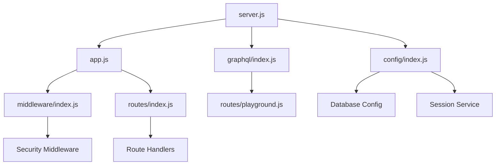

# Modular Server Architecture

This document describes the new modular architecture for the Nectar API server, which breaks down the monolithic `server.js` file into focused, maintainable modules.

## 📁 Architecture Overview

The server has been restructured into the following modules:

```
server/
├── server.js              # Main entry point (streamlined)
├── app.js                 # Express app configuration
├── config/
│   └── index.js          # Environment and service configuration
├── middleware/
│   └── index.js          # Security middleware configuration
├── routes/
│   └── index.js          # Route mounting configuration
└── graphql/
    └── index.js          # GraphQL server configuration
```

## 🎯 Module Responsibilities

### **server.js** (Main Entry Point)
- Server startup orchestration
- Service initialization coordination
- Graceful shutdown handling
- **Lines reduced**: 548 → 89 (83% reduction)

### **config/index.js** (Configuration Module)
- Environment variable setup and validation
- Database connection configuration
- Service initialization
- **Features**: Centralized config management

### **middleware/index.js** (Security Middleware)
- Helmet security headers configuration
- CORS policy setup
- Rate limiting application
- Activity logging and performance monitoring
- **Features**: Complete security stack in one place

### **routes/index.js** (Route Configuration)
- Centralized route mounting
- Middleware application per route group
- CSRF protection configuration
- Authentication and authorization setup
- **Features**: Clear route organization and protection

### **app.js** (Express Configuration)
- Express app setup and configuration
- Request/response logging
- MongoDB connection handling
- Production static file serving
- **Features**: Clean app configuration separation

### **graphql/index.js** (GraphQL Setup)
- Apollo Server initialization
- GraphQL playground configuration
- WebSocket subscription setup
- GraphQL-specific middleware
- **Features**: Complete GraphQL stack separation

## ✅ Benefits Achieved

### **Maintainability**
- **Single Responsibility**: Each module has one clear purpose
- **Easy Testing**: Modules can be tested independently
- **Clearer Dependencies**: Import relationships are explicit
- **Reduced Complexity**: 548-line monolith → 6 focused modules

### **Development Experience**
- **Easier Navigation**: Find specific functionality quickly
- **Parallel Development**: Multiple developers can work on different modules
- **Clear Interfaces**: Module boundaries are well-defined
- **Better Error Isolation**: Issues are contained within modules

### **Configuration Management**
- **Centralized Config**: All environment setup in one place
- **Validation**: Environment validation happens early
- **Service Coordination**: Clean service startup orchestration
- **Error Handling**: Better error boundaries and reporting

## 🔧 Migration Guide

### **Before** (Monolithic server.js)
```javascript
// 548 lines of mixed concerns:
// - Environment setup
// - Security middleware
// - Route mounting
// - GraphQL setup
// - Server startup
// - Static file serving
// - Error handling
```

### **After** (Modular Architecture)
```javascript
// server.js - Clean entry point
const { initializeEnvironment, initializeServices } = require('./config');
const { app, configureApp, addProductionMiddleware } = require('./app');
const { initializeGraphQL, initializeSubscriptions } = require('./graphql');

const startServer = async () => {
  await initializeServices();
  configureApp();
  await initializeGraphQL(app);
  addProductionMiddleware(app);
  // ... start server
};
```

## 📈 Performance & Monitoring

### **Startup Performance**
- **Modular Loading**: Modules load only when needed
- **Clear Dependencies**: Explicit loading order prevents issues
- **Better Error Reporting**: Startup failures are more specific

### **Development Performance**
- **Hot Reloading**: Individual modules can be reloaded independently
- **Faster Testing**: Test specific modules without full server startup
- **Clearer Debugging**: Issues are contained within specific modules

## 🔒 Security Benefits

### **Centralized Security**
- **Security Middleware**: All security config in `middleware/index.js`
- **CSRF Configuration**: Centralized CSRF protection rules
- **Rate Limiting**: Consistent application across all routes
- **Header Security**: Complete Helmet configuration in one place

### **Route Protection**
- **Authentication**: Clear auth middleware application
- **Authorization**: Consistent permission checking
- **Input Validation**: Centralized validation rules
- **Error Handling**: Secure error responses

## 🧪 Testing Strategy

### **Unit Testing**
```javascript
// Test individual modules
describe('middleware/index.js', () => {
  it('should apply security headers', () => {
    // Test security middleware
  });
});

describe('routes/index.js', () => {
  it('should mount routes with correct middleware', () => {
    // Test route mounting
  });
});
```

### **Integration Testing**
```javascript
// Test module interactions
describe('Server Integration', () => {
  it('should start server with all modules', async () => {
    // Test full server startup
  });
});
```

## 🚀 Deployment Considerations

### **Production Deployment**
- **Same Functionality**: All existing functionality preserved
- **Environment Variables**: Same configuration requirements
- **Static Files**: Production static file serving unchanged
- **Process Management**: PM2 configuration remains compatible

### **Rollback Plan**
- **Original File**: `server.js` backed up as reference
- **Drop-in Replacement**: New structure is functionally equivalent
- **Configuration**: No environment variable changes needed

## 📝 Future Enhancements

### **Potential Improvements**
1. **Service Layer**: Extract business logic into service modules
2. **Plugin System**: Modular plugin architecture for features
3. **Config Validation**: Enhanced environment validation
4. **Health Checks**: Modular health check system
5. **Metrics**: Per-module performance monitoring

### **Code Quality**
- **ESLint Rules**: Module-specific linting rules
- **Type Safety**: Gradual TypeScript adoption per module
- **Documentation**: Per-module API documentation
- **Testing Coverage**: Module-specific test coverage targets

## 🔗 Module Dependencies



This modular architecture provides a solid foundation for future development while maintaining all existing functionality and security features.