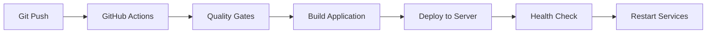

# Nectar API Deployment Guide

## 🚀 Overview

This guide explains the deployment process for Nectar API using GitHub Actions CI/CD pipeline.

## 📋 Deployment Architecture

```
Windows Dev → GitHub → GitHub Actions → Build → Linux Servers (Staging/Production)
```

### Key Benefits
- **One-click deployments** via GitHub push
- **Consistent builds** across environments
- **Zero-downtime deployments** with health checks
- **Automatic rollback** capability
- **No more manual SSH/PuTTY sessions**

## 🔧 Initial Setup (One-time per server)

### 1. Server Preparation

SSH into each Linux server and run:

```bash
# Download and run setup script
curl -o setup-deployment.sh https://raw.githubusercontent.com/yourusername/nectar-api/main/scripts/setup-deployment.sh
chmod +x setup-deployment.sh
./setup-deployment.sh
```

This script will:
- Install Node.js and npm
- Setup MongoDB tools for backups
- Create necessary directories
- Generate sample configuration files

### 2. GitHub Repository Setup

#### Create GitHub Secrets

Go to your repository Settings → Secrets and variables → Actions, and add:

| Secret Name | Description | Example |
|------------|-------------|---------|
| `STAGING_HOST` | Staging server IP | `192.168.1.100` |
| `PRODUCTION_HOST` | Production server IP | `192.168.1.101` |
| `SSH_USER` | SSH username | `ubuntu` |
| `SSH_KEY` | Private SSH key content | Copy entire private key |
| `GITHUB_TOKEN` | Auto-generated (already exists) | - |

#### Enable GitHub Packages

1. Go to Settings → Packages
2. Enable "Improved container support"
3. Set package visibility to "Private" (or as needed)

### 3. Environment Configuration

On each server, edit `/home/ubuntu/nectar-api/.env.production`:

```bash
# Critical settings to update:
JWT_SECRET=<generate-random-32-char-string>
ENCRYPTION_KEY=<generate-random-string>

# SQL Server (if using)
SQL_SERVER_HOST=your-sql-server
SQL_SERVER_USER=your-username
SQL_SERVER_PASSWORD=your-password
```

## 📦 Deployment Process

### Automatic Deployment

Simply push to the appropriate branch:

```bash
# Deploy to staging
git push origin staging

# Deploy to production
git push origin main
```

The GitHub Actions workflow will:
1. Run quality checks (linting, tests, security)
2. Build production bundle
3. Deploy to appropriate server
4. Run health checks
5. Restart application services

### Manual Deployment

For manual deployments or hotfixes:

```bash
# From GitHub Actions page
# Go to Actions → Build & Deploy → Run workflow
# Select environment (staging/production)
```

### Local to Server Deployment (Emergency)

If GitHub Actions is unavailable:

```bash
# On your Windows machine
npm run build
tar -czf nectar-api-build.tar.gz build/

# Transfer to server
scp nectar-api-build.tar.gz ubuntu@server:/home/ubuntu/

# On server
tar -xzf nectar-api-build.tar.gz
pm2 restart nectar-api
```

## 🔄 Deployment Workflow

### Branch Strategy

```
main         → Production deployment
staging      → Staging deployment
feature/*    → No automatic deployment
```

### Deployment Flow



### Zero-Downtime Deployment

The deployment uses blue-green strategy:
1. New application version deployed alongside current one
2. Health checks verify new deployment
3. Traffic switches to new container
4. Old container is removed

## 🔍 Monitoring & Troubleshooting

### View Deployment Status

```bash
# Check GitHub Actions
# https://github.com/yourusername/nectar-api/actions

# On server
pm2 status
pm2 logs nectar-api --lines 50
```

### Health Checks

```bash
# Check application health
curl http://localhost:3001/health

# Check application process
pm2 show nectar-api
```

### Common Issues & Solutions

#### Issue: Deployment fails at "Authentication"
**Solution**: Check GitHub token permissions
```bash
# Re-authenticate with GitHub
echo $GITHUB_TOKEN | gh auth login --with-token
```

#### Issue: Health check fails after deployment
**Solution**: Check logs and environment variables
```bash
pm2 logs nectar-api --lines 100
env | grep -E "(NODE_ENV|PORT|MONGODB)"
```

#### Issue: "Permission denied" errors
**Solution**: Fix volume permissions
```bash
sudo chown -R 1001:1001 server/logs server/backups server/uploads
```

## 🔐 Security Best Practices

1. **Never commit secrets** - Use environment variables
2. **Rotate credentials regularly** - Update JWT_SECRET quarterly
3. **Use SSH keys** - Never passwords for server access
4. **Limit GitHub token scope** - Only `write:packages` permission
5. **Backup before deployment** - Automatic in workflow

## 📊 Rollback Procedure

### Automatic Rollback

If deployment fails, the system automatically maintains the previous version.

### Manual Rollback

```bash
# On server
cd /home/ubuntu/nectar-api

# View available backups
ls -la /home/ubuntu/deployment-backups/

# Rollback to specific version
pm2 stop nectar-api
cp /home/ubuntu/deployment-backups/YYYYMMDD_HHMMSS/* /home/ubuntu/nectar-api/
pm2 start nectar-api

# Or restore from backup
cd /home/ubuntu/deployment-backups/
ls -la  # Find appropriate backup
cp YYYYMMDD_HHMMSS/.env* /home/ubuntu/nectar-api/
```

## 📈 Performance Optimization

### Application Optimization
- Tree-shaking reduces bundle size
- Code splitting improves load times
- Production builds only include necessary dependencies

### Resource Monitoring
```yaml
# PM2 ecosystem file
deploy:
  max_memory_restart: '2G'
  instances: 2
  exec_mode: 'cluster'
```

### Monitoring Commands
```bash
# Check resource usage
pm2 monit

# Check disk usage
df -h

# Clean up old logs
journalctl --vacuum-time=7d
```

## 🎯 Migration from Current Setup

### Phase 1: Test in Staging (Week 1)
1. Set up staging server with Node.js and PM2
2. Configure GitHub Secrets
3. Test automated deployments
4. Verify all features work

### Phase 2: Production Preparation (Week 2)
1. Schedule maintenance window
2. Backup production database
3. Install Node.js and PM2 on production
4. Test rollback procedures

### Phase 3: Go Live (Week 3)
1. Deploy during low-traffic period
2. Monitor closely for 24 hours
3. Document any issues
4. Train team on new process

## 📝 Deployment Checklist

Before each deployment:

- [ ] All tests passing locally
- [ ] Environment variables updated (if needed)
- [ ] Database migrations prepared
- [ ] Backup verified
- [ ] Team notified of deployment window
- [ ] Monitoring dashboard open

After deployment:

- [ ] Health checks passing
- [ ] Logs checked for errors
- [ ] Key features smoke tested
- [ ] Performance metrics normal
- [ ] Team notified of completion

## 🆘 Emergency Contacts

- **DevOps Issues**: Create GitHub issue with `deployment` label
- **Critical Failures**: Use rollback procedure immediately
- **GitHub Actions Support**: https://github.com/support

---

## Quick Reference

```bash
# Deploy to staging
git push origin staging

# Deploy to production  
git push origin main

# Check deployment status
pm2 status

# View logs
pm2 logs nectar-api

# Rollback
./deploy.sh previous-version

# Health check
curl http://localhost:3001/health
```